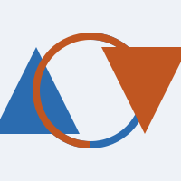

# Sreekanth — 2026-09-06

## 5 Things (words / idioms / phrases / interesting communication tips)

1. **Boomerang** — a word with several meanings depending on context:
   - **Original meaning (physical object)**: a curved, flat wooden tool originally created by Indigenous Australians. When thrown correctly, its aerodynamic shape causes it to <mark style="background-color:#FFE066">fly in a large curve and return to the thrower</mark>.

     
   - **Idiom / verb (to backfire)**: an action or plan that <mark style="background-color:#FFE066">comes back to affect the person who started it, usually with negative consequences</mark>. Example: "His attempt to trick his coworkers boomeranged on him when he was the one who got caught."
   - **Workplace trend ("boomerang employee")**: someone who leaves a company to work elsewhere (or retire), but <mark style="background-color:#FFE066">later returns to work for their original employer</mark>. Example: "Our company loves hiring boomerang workers because they already understand our team culture."
   - **Social media (Instagram feature)**: a short video clip that <mark style="background-color:#FFE066">loops forward and backward continuously to create a mini-animation</mark>. Example: "Let's take a boomerang of us clinking our glasses together before dinner!"

     
2. **Under-caffeinated** — informal way of saying you <mark style="background-color:#FFE066">haven't had enough coffee yet and are feeling low-energy or slow</mark>. Example: "Sorry if I'm slow to follow, I'm a bit under-caffeinated this morning."
3. **Canon Event** — a <mark style="background-color:#FFE066">crucial, inevitable, or highly challenging life experience that shapes an individual's identity or career path</mark>. Example: "Failing that first sales pitch felt terrible, but looking back, it was a canon event that taught me how to present effectively."
4. **Captivating** — holding your attention completely because something is <mark style="background-color:#FFE066">incredibly interesting, engaging, or beautiful</mark>. Examples:
   - "The opening scene of the presentation was captivating and instantly grabbed the audience."
   - "Her storytelling style is so captivating that no one checks their phone during her talks."
   - "The product demo had a captivating hook — a live customer problem being solved in real time."
   - "He gave a captivating account of the project's turnaround, and the room was silent until he finished."
5. **Doomscrolling** — the act of <mark style="background-color:#FFE066">obsessively or compulsively scrolling through social media feeds or negative news online, even when it is upsetting</mark>. Example: "Instead of doomscrolling on your phone before the interview, take a few deep breaths to focus your mind."
6. **Cortisol Coded** — used to describe a visual, environment, or message that <mark style="background-color:#FFE066">instantly triggers high stress or anxiety</mark>. Example: "We need to clean up these slides; right now, the cluttered text and chaotic layout look completely cortisol coded."
7. **Reticulated Python** — <mark style="background-color:#FFE066">the world's longest snake species</mark>, native to South and Southeast Asia; "reticulated" refers to the net-like, diamond-shaped pattern on its skin. Seen on a sign at the Philadelphia Zoo. Example: "The reticulated python at the Philly Zoo can grow over 20 feet long."

## Topic Presentation (optional)

- Topic:
- Notes:

## Feedback Received

-
